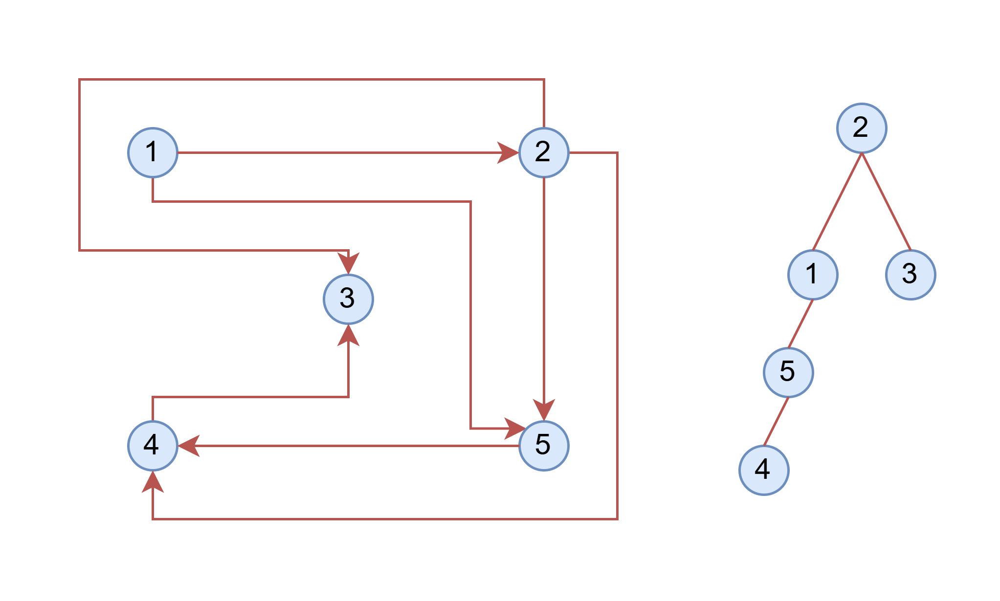

# Autobus - Strutture dati e algortmi

 
## 1 Funzionalità
### 1.1 GUI

### 1.5 Input/Output (File o tastiera)  

## 2.  Dependency

### TK tinker

## 3. Algoritmi di Ordinamento 
Gli algoritmi di ordinamento sono degli algoritmi che preso in ingresso una lista di oggetti siano essi numeri, stringhe, o istanze di una classe.
Restituiscono una lista dove ogni uno degli elementi segue la legge secondo la quale l'elemento precedente e minore di quello successivo
>a<sub>1</sub> < a<sub>2</sub> < a<sub>3</sub>


> [!WARNING]
> Per far in modo che il software funzioni correttamente anche nel ordinamento di un vettore di oggetti quindi è necessario definire i metodi 
> `__lt__` e `__gt__` per poter usare gli operatori di confronto anche su istanze di classi

Ecco la spiegazione completa per **3.2 Merge Sort**, **3.4 Insertion Sort** e **3.5 Quicksort**, in modo coerente con le altre sezioni:
 ### 1.1 Counting Sort

- L'algoritmo in oggetto partendo dall'array che deve ordinare crea un nuovo array con l'obbiettivo di contare i valori presenti più volte.
Quindi se questo è l' array di partenza [2, 3, 0, 2, 3, 2] verrà creato l' array [0, 0, 0, 0] con 4 posizioni perché il valore più alto è 3 
(Deve esistere un indice 3)
- Viene popolato l' array contando le corrispondenze **es: il numero 2 è presente 2 volte la cella all'indice 2 subirà due incrementi**. 
  Ogni volta che facciamo un incremento quel valore viene eliminato dal vettore
  Quindi otterremo i due array [] e [ 1, 0, 3, 2]
- Ora ricostruiamo il valore originale avendo pero cura di mettere gli elementi in ordine per farlo scansioniamo l' array del conteggio e vediamo 
  che abbiamo 1 elemento con valore 0 lo sappiamo perché l'indicè representa il valore mentre il numero rapresenta il numero di valori
- Quindi inseriamo 1 elemento con valore 0 nell' array e decrementiamo di 1 l'elemento all'indice 0 nell' array di conteggio. Quindi il valore 
  attuale sara [0] per l' array di output e [0, 0, 3, 2] per l' array di conteggio dato che il valore che stiamo usando è arrivato a 0 ci 
  spostiamo più in là e riprendiamo l'esecuzione.
- fiche non troviamo nessun valore nell' array di conteggio in quel caso abbiamo terminato

L'algoritmo ha una complessità di O(n<sup>2</sup>) ma è importante sottolineare che questo algortmo va utilizato se da una analisi dei dati ci 
accorgiamo che i nostri dati sono doppioni in oltre è preferibile che il numero di elementi sia considerevole

### 3.2 Merge Sort

Merge Sort è un algoritmo di ordinamento che utilizza la strategia divide et impera. Divide ricorsivamente l'array in due metà fino a ottenere sottovettori di dimensione uno (che sono considerati ordinati). Successivamente, fonde (merge) queste sottosequenze ordinate per ottenere array più grandi ordinati, fino a ricostruire l'array completo ordinato. La fusione avviene confrontando gli elementi dei due sottovettori e inserendo nell’array di output l’elemento minore in modo ordinato. La complessità temporale di Merge Sort è O(n log n) in tutti i casi, rendendolo molto efficiente per grandi quantità di dati. Tuttavia, richiede spazio aggiuntivo proporzionale alla dimensione dell'array da ordinare.
 ### 3.3 Bubblesort  
L'algoritmo di Bubble Sort è uno degli algoritmi di ordinamento meno efficienti. Come altri algoritmi di ordinamento, ricostruisce un array ordinato partendo da uno non ordinato tramite una serie di scambi.

Il procedimento consiste nell'utilizzare due cicli annidati: il primo punta a un elemento e il secondo punta all'elemento successivo. Se i due 
elementi sono già in ordine, il secondo indice avanza; altrimenti, i due elementi vengono scambiati. Questo processo si ripete fino a quando 
l'intero array risulta ordinato. 

L'algoritmo di Bubble Sort non presenta miglioramenti con array semi ordinati e la sua complessita e di O(n<sup>2</sup>) dato da i due cicli che 
scansionano l'array.

### 3.4 Insertion Sort

Insertion Sort è un algoritmo di ordinamento semplice ed efficiente per array piccoli o quasi ordinati. Funziona scorrendo l'array da sinistra a destra, prendendo un elemento alla volta e inserendolo nella posizione corretta rispetto agli elementi già ordinati a sinistra. Questo avviene spostando gli elementi maggiori verso destra per fare spazio al nuovo elemento. L’algoritmo ha complessità O(n²) nel caso peggiore, ma può raggiungere O(n) se l’array è già quasi ordinato, poiché riduce il numero di spostamenti. È facile da implementare e stabile, cioè mantiene l’ordine degli elementi uguali.
 

### 3.5 Quicksort

Quicksort è uno degli algoritmi di ordinamento più usati e veloci nella pratica. Anche questo usa la strategia divide et impera: seleziona un elemento chiamato **pivot** e partiziona l’array in due sottovettori, uno con gli elementi minori o uguali al pivot e uno con quelli maggiori. Quindi ordina ricorsivamente questi due sottovettori. La scelta del pivot è cruciale per l’efficienza: un buon pivot permette di ottenere una divisione equilibrata dell’array. La complessità media di Quicksort è O(n log n), ma nel caso peggiore (ad esempio array già ordinati con pivot sempre minimo o massimo) può degradare a O(n²). Quicksort è molto efficiente nella pratica ed è spesso preferito a Merge Sort per via della minore necessità di spazio aggiuntivo.

 

# 4. Strutture Dati  
### 4.1 Liste  
La lista è una struttura dati che memorizza una sequenza ordinata di elementi, consentendo l’accesso, l’inserimento e la rimozione di elementi in 
posizioni arbitrarie. è stata implementata come lista collegata (linked list). La lista è più 
flessibile di pila e coda perché non ha vincoli rigidi su dove si può inserire o rimuovere un elemento, ed è molto usata per gestire collezioni di 
dati ordinati o modificabili.
### 4.2 Pile  
La pila è una struttura dati lineare che segue la logica LIFO (Last In, First Out), cioè "l'ultimo elemento inserito è il primo a uscire". Le due 
operazioni principali sono push, che inserisce un elemento in cima alla pila, e pop, che rimuove l'elemento più recente inserito.
### 4.3 Code  
 La coda è una struttura dati lineare che segue la logica FIFO (First In, First Out), cioè "il primo elemento inserito è il primo a uscire". Le 
 due operazioni principali sono enqueue, che inserisce un elemento in fondo alla coda, e dequeue, che rimuove l'elemento in testa alla coda. 
### 4.4 Alberi
Gli **alberi** sono strutture dati non lineari. Proprio come le liste, ogni nodo contiene informazioni utili a identificare i propri figli, che a 
loro volta sono nodi. Tuttavia, a differenza delle liste, ogni nodo di un albero può avere più di un singolo successore. Il tipo di albero 
dipende infatti dal numero di successori che un nodo può avere. Se il numero di figli di ogni nodo è uguale o minore a due, si parla di **albero  
binario**; altrimenti, si parla semplicemente di **albero** o, se il numero di figli è definito, di **albero N-ario**.

La struttura dati è chiamata "albero" perché ricorda la forma di un albero capovolto. Seguendo questa analogia, il punto iniziale della struttura viene chiamato **radice**, mentre i nodi terminali sono detti **foglie**. Inoltre, vengono chiamate **rami** le connessioni tra i vari nodi, che nel codice sono rappresentate da variabili definite come puntatori ai nodi figli.

Gli alberi possiedono diverse proprietà che li descrivono:

- **Dimensione**: rappresenta il numero totale di nodi contenuti nell'albero.
- **Altezza**: rappresenta il percorso che conta più salti tra la radice e una foglia. Questo è un parametro che preferiamo mantenere basso, perché nelle operazioni che usano gli alberi come strutture dati, l'altezza rappresenta il caso peggiore in termini di complessità computazionale.
- **Livelli**: sono insiemi di nodi che si trovano alla stessa distanza dalla radice, cioè che hanno la stessa profondità (numero di salti dalla radice).

Esistono anche vari modi per chiamare un singolo nodo:
- **Padre**: un nodo che ha almeno un altro nodo sotto di lui.
- **Fratelli**: i nodi che hanno lo stesso nodo padre.
- **Figli**: i nodi che sono sottostanti a un nodo.

Inoltre, viene chiamato **sottoalbero** un albero costituito da un nodo e dai suoi figli.

#### 4.4.1 Alberi di ricerca
Gli **alberi di ricerca** sono particolari alberi nei quali i nodi sono disposti secondo un criterio specifico. Questo ordine facilita la ricerca di un determinato valore senza la necessità di percorrere tutto l'albero. Questo è particolarmente utile quando si utilizzano gli alberi per memorizzare informazioni che devono essere lette frequentemente o quando si lavora con grandi quantità di dati.

La differenza tra un albero non ordinato e un albero ordinato è che la complessità di ricerca scende da **O(n)** a **O(log n)**. Tuttavia, se l'albero non viene bilanciato, la complessità può crescere nuovamente fino a **O(n)**, formando un albero definito **degenerato**, in cui ogni nodo ha un solo figlio e l'albero si riduce a una lista.

### 2.5 Grafi
Il grafo è un altra struttura dati non lineare si usa per rappresentare relazioni tra oggetti generalmente un grafo viene rappresentato tramite 
l'unione ordinata di due insiemi G = (V, E) dove V è l'insieme di nodi mentre E è l'insieme di archi.
I due vertici connessi da un arco prendono il nome di estremi di un arco, La relazione può essere simetrica o non simetrica in questultimo caso si 
parla di grafo orientato. Ad ogni arco è possibilie assegnare una quantita questo viene definita peso.
i numeri di archi che sono connessi a un nodo (I/O) vengono definiti grado. Il grado massimo del grafo e il grado maggiore che ha un nodo al suo 
interno, mentre il grado minimo e il grado piu basso che ha il nodo al suo interno un grafo si definische nullo se se non sono presenti archi al 
suo interno G = (V, Ø).
Un grafo si dice completo se presi due punti qualsiasi questi sono collegati da un arco.

La densità di un grafo è una misura che indica quanto il grafo è "pieno" di archi rispetto al numero massimo possibile di archi che potrebbe avere.
Serve per capire quanto è connesso un grafo. 
 
Densità = $\frac{2 * E}{v * (v-1)}$

Un cammino è la seguenza di archi che connette due nodi si dice circuito se V<sub>0</sub> = V<sub>n</sub> mentre se non sono ripetuti nodi è detto 
ciclo

Il cammico che conette due punti con il minor numero di archi è detto cammino minimo.

é possibile rapresentare un grafo per `Indicenza` e per `Addiacenza`


Il Grafo che usiamo nel esercizio

#### 2.5.1 Addiacenza
Nella rappresentazione tramite matrici di adiacenza i vertici vengono numerati da 1 a N. Si definisce una 
matrice NxN dove a<sub>ij</sub> verrà valorizata: 
- al peso dell arco se i nodi numerati con i o j sono estremi del arco e
- 0 altrimenti

Quindi il grafo con queste caratteristiche: 

Archi (7) : 

	Arco: Da:Nodo_1, A:Nodo_2 

	Arco: Da:Nodo_1, A:Nodo_5 

	Arco: Da:Nodo_2, A:Nodo_5 

	Arco: Da:Nodo_5, A:Nodo_4 

	Arco: Da:Nodo_2, A:Nodo_4 

	Arco: Da:Nodo_2, A:Nodo_3 

	Arco: Da:Nodo_4, A:Nodo_3 

Nodi (5) : 

	Nodo_1 

	Nodo_2 

	Nodo_3 

	Nodo_4 

	Nodo_5 

verrà rapresentato in una matrice 5 x 5 simile a questa:
```
		 1	2	3	4	5	 


1 		 0	1	0	0	1	
2 		 1	0	1	1	1	
3 		 0	1	0	1	0	
4 		 0	1	1	0	1	
5 		 1	0	0	1	0	
```

Un altro modo per rapresentare un grafo è per addiacenza sono le liste in questo caso si crea una array di liste. Per farlo si crea una lista per 
ogni nodo e si aggiungono ad essa tutti i nodi che è possibilie raggiungere direattamente quindi il grafo di prima viene rapresentato così:

```
|Nodo_1| --> 2 --> 5 --> Ø
|Nodo_2| --> 1 --> 5 --> 4 --> 3 --> Ø
|Nodo_3| --> 2 --> 4 --> Ø
|Nodo_4| --> 5 --> 2 --> 3 --> Ø
|Nodo_5| --> 1 --> 4 --> Ø
```

#### 2.5.2 Indicenza 
Un altro modo più efficente per rapresentare un grafo è la matrice di indicenza. Questo metodo utilizza una matrice NxM dove N è il numero di 
nodi Mentre M è il numero di archi
poi la matrice viene popolato ponendo aij

- Uguale a 1 se j ha come estremo i
- 0 altrimenti

Se i Grafi sono orientati si aggiunge una terza opzione

- 1 se j entra in I
- -1 se j esce da i
- 0 altimenti

### 2.5.3 Visita in ampiezza
La visita in ampiezza (BFS) costruisce un albero di visita con radice in s cioè il nodo di partenza chiamato anche sorgente, visitando i nodi a 
livelli, cioè prima tutti i vicini del nodo corrente, poi i vicini dei vicini, e così via. Per gestire lo stato di visita di ciascun nodo, si usa 
un attributo chiamato colore:

- Bianco: nodo non ancora visitato
- Grigio: nodo scoperto ma non completamente esplorato
- Nero: nodo completamente visitato

L’esplorazione avviene utilizzando una coda FIFO per garantire l’ordine corretto nella visita.

### 2.5.4 Cammini minimi
| Caratteristica              | **Dijkstra**                   | **Bellman-Ford**                         |
| --------------------------- | ------------------------------ | ---------------------------------------- |
|  Gestisce pesi positivi     | Sì                             | Sì                                       |
|  Gestisce pesi **negativi** | **No**                         |  **Sì**                                  |
|  Rileva cicli negativi      | No                             |  **Sì**                                  |
| Complessità (con heap)      | **O((V + E) log V)**           | O(V × E)                                 |
|  Semplicità implementativa | Più complesso (con coda prior.) | Più semplice                             |
|  Calcola i **percorsi minimi** |  (con `predecessore`)          | Solo se lo aggiungi tu                   |
|  Output                   | Distanze + Percorsi            | Distanze (o anche percorsi, se modificato) |
 

| Algoritmo    | Problema risolto                   | Pesi negativi?  | Tipo grafo                | Applicazione tipo           |
| ------------ | ---------------------------------- | --------------- | ------------------------- | --------------------------- |
| Bellman-Ford | Cammini minimi (con pesi negativi) | Sì              | Orientato                 | Reti, finanza (arbitraggio) |
| Dijkstra     | Cammini minimi (pesi non negativi) | No              | Orientato o non orientato | GPS, routing, robotica      |
| Prim         | Albero di copertura minimo         | Non applicabile | Non orientato             | Reti elettriche, strade     |
| Kruskal      | Albero di copertura minimo         | Non applicabile | Non orientato             | Reti, clustering            |
